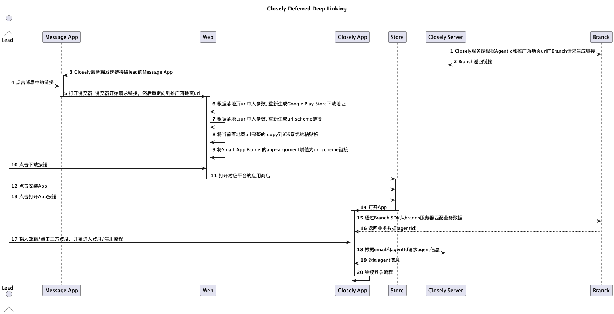
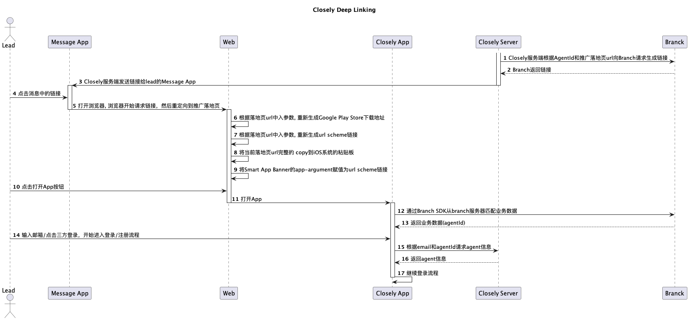

#### 一、需求

根据AgentId生成推广链接；当Lead通过推广链接安装后打开App或直接打开App时，为Lead指定登录的Agent。

#### 二、方案概述
采用第三方Branch服务；Branch是一家提供移动链接和营销解决方案的技术公司。他们的主要产品是深度链接平台，主要帮助开发者创建、管理和跟踪移动应用程序中的深度链接。

- 快速实现需求，节省开发成本（后端不需要实现创建链接/管理链接，Lead的点击事件也不需要存储到服务器，以及维护点击事件的生命周期，在App中Branch SDK会将当前会话与之前点击事件相关联）
- 每月1w活跃用户免费，超过1w时每增加1k收5美元/月
- 提供跨平台解决方案，支持iOS，Android，Web

**Deferred Deep Linking**


**DeepLink**


#### 三、技术实现

##### Branch平台
1. 注册账号，设置信用卡
2. 自定义链接域名（可选择）

##### Server端
1. 从Branch后台获取Branch Key
2. 生成和Agent相关的链接，[文档地址](https://help.branch.io/developers-hub/reference/createdeeplinkurl)
```sh
生成一个agentId是20230831的链接
curl --request POST \
    --url https://api2.branch.io/v1/url \
    --header 'accept: application/json' \
    --header 'content-type: application/json' \
    --data '
{
 "data": {
   "$fallback_url": "https://static.chimeroi.com/closely-download/index.html?agentId=20230831",
   "$web_only": true,
   "$ios_nativelink": true,
   "agentId": 20230831
 },
 "branch_key": "key_live_hCap0I6Rzle2anqxNTzHNnepwBma7PHg"
}
'

Branch返回结果：
{"url":"https://mybittrack.app.link/e/saWisfDdwCb"}
```
3. 将链接发送给Lead
4. 提供App根据email+agentId查询agent信息的接口


>_Branch后台API限制：_
>_每秒 100 个请求_
>_每分钟 5,500 个请求_
>_每小时 300,000 个请求_

<br>
##### Web端
1. 根据落地页url中入参数, 重新生成Google Play Store下载地址

```js
// 点击Branch Link后会重定向到下面这个链接：
https://static.chimeroi.com/closely-download/index.html?agentId=20230831&_branch_referrer=H4sIAAAAAAAAA8soKSkottLXz61MyiwpKUpMztZLLCjQy8nMy9ZP1S9ODM8sTnNJKXdOAgCugyoTKQAAAA%3D%3D&%24web_only=true&_branch_match_id=1223174906285908938

// 根据重定向链接可以得到如下关键参数：
agentId
_branch_referrer
_branch_match_id

// 生成referrer值
先按照link_click_id={_branch_match_id}&utm_source=PlayStore拼接，再urlEncode

// 例子
拼接后：link_click_id=1223174906285908938&utm_source=PlayStore
urlEncode后：link_click_id%3D1223174906285908938%26utm_source%3DPlayStore
referrer=link_click_id%3D1223174906285908938%26utm_source%3DPlayStore

# 生成跳转Google Play Store下载链接
market://details?id=com.renren.android.chimesite&_branch_match_id={_branch_match_id}&referrer={referrer}
```

2. 根据落地页url中入参数, 重新生成url scheme链接
```js
// 根据重定向链接可以得到如下关键参数：
_branch_referrer
_branch_match_id

chimesiteweb://open?_branch_referrer={_branch_referrer}&link_click_id={_branch_match_id}
```
3. 将当前落地页url完整的 copy到iOS系统的粘贴板

4. 将Smart App Banner的app-argument赋值为url scheme链接

##### App
1. 集成Branch SDK
2. 通过Branch SDK获取到agentId
3. 根据email+agentId查询接口查询agent信息

> - 从Branch链接获取到agentId存储在App本地，当登录成功后或切换Agent时删除本地agentId
> - 每次通过Branch链接获取到agentId，则替换之前存储的agentId
> - 已登录App通过Branch链接打开App，忽略获取的agentId

#### 四、风险
1. iOS没有系统的安装追踪方案，Branch的流程依赖广告id，粘贴板，网络环境等不确定因子，如果这些因子不稳定，可能就会出现打开App是匹配不到agentId